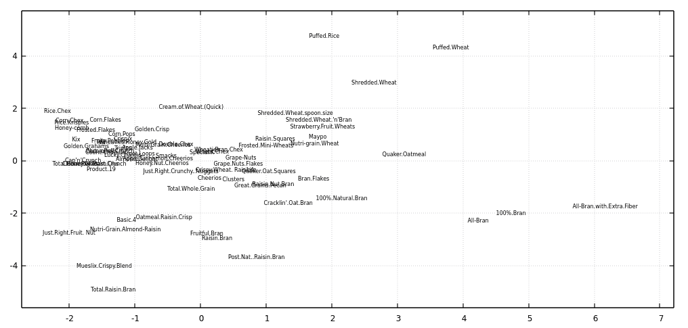

# pcacsv

Read CSV, do [principal component analysis](https://en.wikipedia.org/wiki/Principal_component_analysis) of specified columns and output input data augumented with additional columns containing the result of PCA, i.e. specified input values linearly mapped in a way that eariler coordinates have more variation than the latter ones and coordinates are orthogonal.

## Example

Using [80 cereals](https://www.kaggle.com/datasets/crawford/80-cereals/) dataset.

```
$ wget https://gist.github.com/kcoltenbradley/1e8672cb5dff4a4a5e8dbef27ac185f6/raw/9a311a88d5aabdfddd4c9f0d1316612ec33d3d5e/cereal.csv

$ pcacsv 4:15 cereal.csv -o output.csv  -t 0.8

$ xsv table output.csv | head -n5 | cut -c 1-70
coord1   coord2   Cereal Name                  Manufacturer
4.7320   -1.9756  100%_Bran                    Nabisco
2.1465   -1.4111  100%_Natural_Bran            Quaker Oats
4.2294   -2.2574  All-Bran                     Kelloggs
6.1734   -1.7179  All-Bran_with_Extra_Fiber    Kelloggs

$ tail -n +2 output.csv | tr ',_' ' .' | awk '{print $1, $2, $3}' | feedgnuplot --domain --style 0 'with labels' --rangesize 0 2
```

.


## Installation

Install from source code with `cargo install --path .`  or `cargo install pcacsv`.

It depends on OpenBLAS which is be tricky to (cross)-compile, so no assets on Github Releases this time.

## CLI options

<details><summary> pcacsv --help output</summary>

```
Usage: pcacsv [OPTIONS]

Positional arguments:
  columns                    List of columns to use as coordinates. First column is number 1. Parsing support ranges with steps like 3,4,10:5:100.
  input_path                 Input CSV file

Optional arguments:
  -o, --output OUTPUT        Save file there instead of stdout
  -n, --no-header            First line of the CSV is not headers
  -N, --no-output-header     Do not output CSV header even though input has headers
  -d, --delimiter DELIMITER  Field delimiter in CSV files. Comma by default.
  -r, --record-delimiter RECORD-DELIMITER
                             Override line delimiter in CSV files.
  -t, --tolerance TOLERANCE  Tolerance for excluding low variance components. If not specified, all components are kept.
  -h, --help

```
</details>


## See also

* [csvdimreduce](https://github.com/vi/csvdimreduce/)
